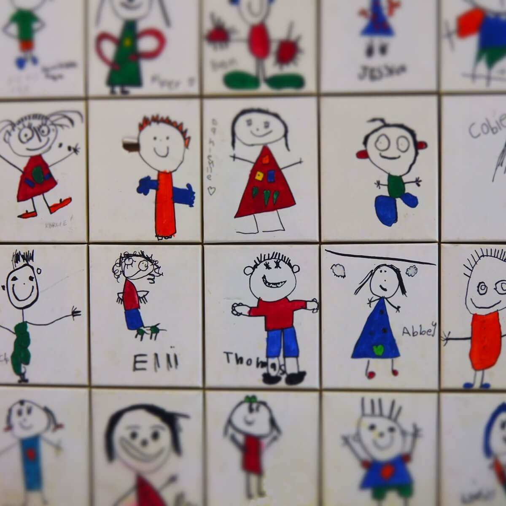

# AGENTS.md

Guidelines for agentic coding agents operating in this repository.

## Project Overview

**OhMySite** — HTML starter kit / шаблон для статических сайтов-портфолио. Построен на Vite + Tailwind CSS v4. Многостраничный сайт без фреймворков, без шаблонизатора — header, footer и sidebar дублируются в каждом HTML-файле.

## Build Commands

```bash
npm install          # Установить зависимости
npm run dev          # Dev-сервер с HMR (автооткрытие браузера)
npm run build        # Production-сборка → dist/
npm run preview      # Локальный просмотр production-сборки
```

Линтеров и тестов нет. Это статический шаблон.

## Tech Stack

- **Vite 6.x** — сборщик и dev-сервер
- **Tailwind CSS 4.x** — utility-first CSS
- **@tailwindcss/vite** — Vite-плагин для Tailwind v4 (обязателен, без него классы не работают)
- **Vanilla JS** — никаких фреймворков

## Project Structure

```
src/
├── styles/
│   └── main.css              # Точка входа CSS: @import "tailwindcss"
├── js/
│   └── script.js             # Vanilla JS (мобильное меню)
├── img/                      # Изображения (jpg, png)
├── index.html                # Главная
├── blog.html                 # Список постов блога (с сайдбаром)
├── post.html                 # Отдельный пост (с сайдбаром)
├── portfolio.html            # Сетка портфолио
├── portfolio-item.html       # Отдельный проект портфолио
├── page.html                 # Обычная страница (с сайдбаром)
├── full-width-page.html      # Полноширинная страница
└── 404.html                  # Страница ошибки

vite.config.js                # Конфиг Vite + Tailwind-плагин
package.json
dist/                         # Результат сборки (gitignored)
```

## Vite Configuration

- `root: 'src'` — исходники в папке src
- `build.outDir: '../dist'` — сборка в корневой dist/
- Все HTML-страницы перечислены как entry points в `rollupOptions.input`
- При добавлении новой страницы — **обязательно добавить её в `rollupOptions.input`**

## Page Layouts

### Общая структура каждой страницы

```html
<!DOCTYPE html>
<html lang="en">
<head>
  <meta charset="UTF-8" />
  <meta name="viewport" content="width=device-width, initial-scale=1.0" />
  <title>Page Title</title>
  <link rel="stylesheet" href="/styles/main.css" />
</head>
<body class="bg-white text-gray-900">
  <header class="py-5">...</header>
  <main>...</main>
  <footer class="bg-gray-900 text-white py-8">...</footer>
  <script type="module" src="/js/script.js"></script>
</body>
</html>
```

Header и footer **копируются** в каждую страницу. Системы partials нет. При изменении навигации или футера — менять во **всех 8 файлах**.

### Типы макетов

| Страница | Макет | Особенности |
|---|---|---|
| `index.html` | Full width | Слайдер, портфолио-карусель, about, блог |
| `portfolio.html` | Full width | Адаптивная сетка 1→2→3→4 колонки |
| `portfolio-item.html` | Full width | Две колонки: текст + изображение |
| `blog.html` | Main + sidebar | `grid-cols-[1fr_300px]`, сайдбар 300px |
| `post.html` | Main + sidebar | Такой же grid, как blog |
| `page.html` | Main + sidebar | Такой же grid, как blog |
| `full-width-page.html` | Full width | Контент без сайдбара |
| `404.html` | Centered | Большой "404" по центру |

## CSS: Tailwind v4

### Точка входа

```css
/* src/styles/main.css */
@import "tailwindcss";
@source "../**/*.html";
```

Кастомного CSS нет — всё через utility-классы Tailwind.

### Цветовая палитра

| Роль | Классы |
|---|---|
| Текст основной | `text-gray-900`, `text-black` |
| Заголовки секций | `text-rose-600` |
| Ссылки | `text-blue-600` |
| Ссылки hover | `hover:text-gray-900` или `hover:text-blue-600` |
| Фон страницы | `bg-white` |
| Фон секций | `bg-gray-50` (чередование) |
| Футер | `bg-gray-900 text-white` |

### Ключевые паттерны

**Контейнер** (вместо стандартного `container`):
```html
<div class="w-[95%] max-w-[1600px] mx-auto">
```

**Отступы секций**:
```html
<section class="py-10 md:py-16">
```

**Ссылки в контенте** (единый паттерн):
```html
<a class="text-blue-600 hover:text-gray-900 transition border-b border-blue-600/20 hover:border-orange-600/20">
```

**Ссылки в навигации**:
```html
<a class="text-black hover:text-blue-600 transition border-b border-gray-400/30 hover:border-blue-600/30">
```

**Портфолио-карточка с group hover**:
```html
<a href="portfolio-item.html" class="block group">
  
  <div>
    <span class="text-blue-600 group-hover:text-gray-900 transition border-b border-blue-600/20 group-hover:border-orange-600/20">Project name</span>
  </div>
</a>
```

**Сетка портфолио** (адаптивная):
```html
<div class="grid grid-cols-1 sm:grid-cols-2 lg:grid-cols-3 xl:grid-cols-4 gap-5">
```

**Макет с сайдбаром**:
```html
<div class="grid md:grid-cols-[1fr_300px] gap-8 md:gap-12">
  <div><!-- Main --></div>
  <aside class="space-y-8"><!-- Sidebar --></aside>
</div>
```

**Слайдер/карусель на CSS scroll-snap**:
```html
<div class="flex overflow-x-auto snap-x snap-mandatory scroll-smooth">
  <div class="min-w-full snap-center">...</div>
</div>
```

### Responsive

Mobile-first подход. Используемые брейкпоинты:
- `sm:` (640px) — мелкие адаптации
- `md:` (768px) — **основной**, переключение mobile → desktop
- `lg:` (1024px) — сетки
- `xl:` (1280px) — 4-колоночные сетки

## JavaScript

Единственный JS-файл — `src/js/script.js`. Содержит только тогл мобильного меню через переключение класса `hidden`:

```javascript
const toggle = document.getElementById('mobile-menu-toggle');
const menu = document.getElementById('mobile-menu');
if (toggle && menu) {
  toggle.addEventListener('click', () => menu.classList.toggle('hidden'));
}
```

## Code Conventions

### HTML
- HTML5, семантические теги (`header`, `nav`, `main`, `aside`, `article`, `footer`)
- Двойные кавычки для атрибутов
- `type="module"` для скриптов
- Самозакрывающиеся теги: `<meta ... />`, ``

### CSS / Tailwind
- Utility-first — никаких кастомных CSS-классов
- Произвольные значения через квадратные скобки: `w-[95%]`, `max-w-[1600px]`, `h-[280px]`
- Opacity через слэш: `border-blue-600/20`, `border-gray-400/30`
- Все переходы через `transition`

### Именование файлов
- HTML: `kebab-case.html`
- JS: `kebab-case.js`
- CSS: `kebab-case.css`

## Important Notes

- **Нет системы шаблонов** — header/footer дублируется в каждом файле. Изменения навигации требуют правки всех 8 HTML-файлов
- **Нет PostCSS-конфига и tailwind.config.js** — Tailwind v4 работает через Vite-плагин, конфигурация не нужна
- **Новые страницы** нужно добавлять в `vite.config.js → rollupOptions.input`
- **Изображения** лежат в `src/img/`, Vite копирует их в dist при сборке
