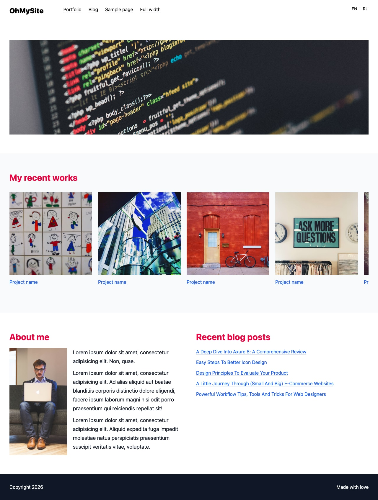

# OhMySite — HTML Starter Kit

This project was created back in 2016 as a simple example and starter template for beginner developers to build their personal websites. It included Gulp, SASS, jQuery, and a partials system — a standard setup of that era.

In 2026, the project received a major update: the entire stack was replaced with modern tools — **Vite**, **Tailwind CSS v4**, and **vanilla JavaScript**. All legacy dependencies (Gulp, SASS, jQuery, Slick) were removed, eliminating security vulnerabilities and reducing complexity.



## Tech Stack

- [Vite 6](https://vite.dev/) — build tool & dev server
- [Tailwind CSS 4](https://tailwindcss.com/) — utility-first CSS framework
- Vanilla JavaScript (ES6+)

## Quick Start

```bash
npm install       # Install dependencies
npm run dev       # Start dev server with HMR
npm run build     # Production build → dist/
npm run preview   # Preview production build
```

## Pages

| Page | File | Description |
|------|------|-------------|
| Home | `index.html` | Hero slider, portfolio carousel, about section, recent posts |
| Portfolio | `portfolio.html` | Responsive project grid (1→4 columns) |
| Project | `portfolio-item.html` | Single portfolio item |
| Blog | `blog.html` | Article list with sidebar |
| Post | `post.html` | Single blog post with sidebar |
| Page | `page.html` | Generic page with sidebar |
| Full Width | `full-width-page.html` | Page without sidebar |
| 404 | `404.html` | Error page |

## Adding a New Page

1. Create a new `.html` file in `src/`
2. Add the entry to `vite.config.js` → `rollupOptions.input`
3. Copy the header and footer from any existing page

## License

MIT
